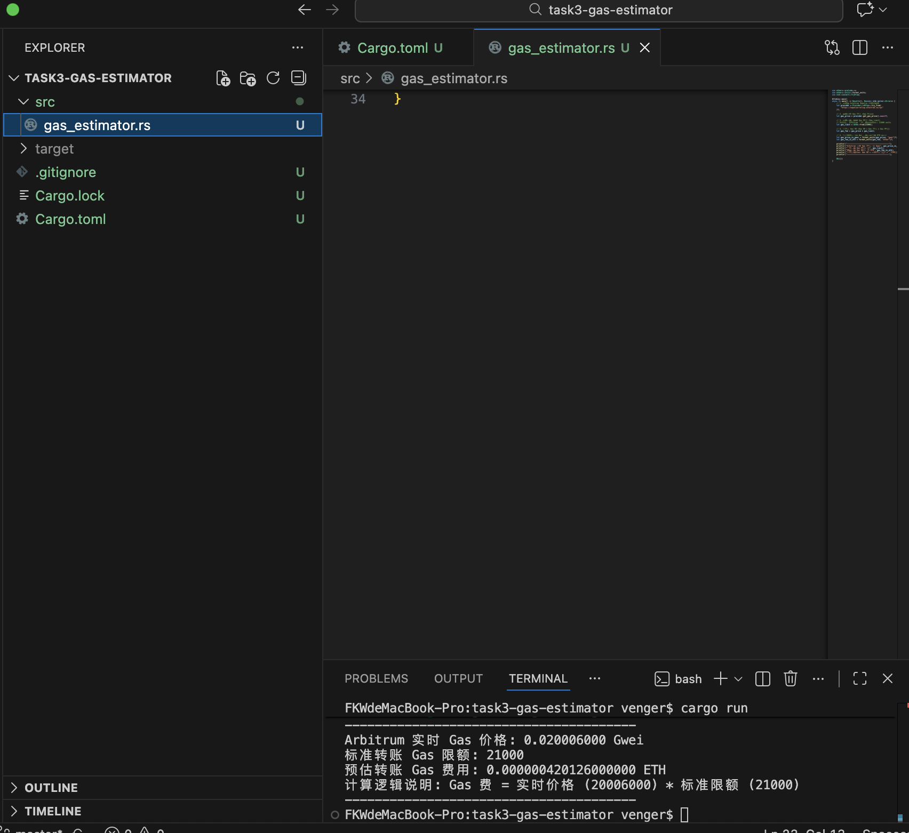
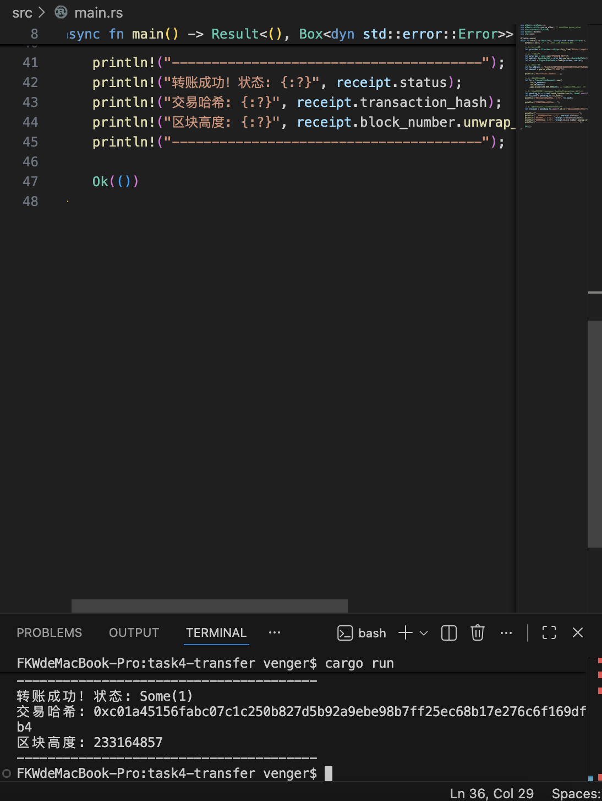

## Task-2: 查询 Arbitrum 测试网地址余额

### 1. 代码路径
`/Task2-balance-query/src/balance.rs`

### 2. 运行结果截图

## Task-3: 计算 Arbitrum 转账 Gas 费用

### 1. 代码路径
`/Task3-gas-estimator/src/gas_estimator.rs`

### 2. 计算逻辑说明
本关卡通过 `ethers-rs` 库动态获取实时 Gas 价格。
计算公式：`Gas 费用 = 实时 Gas 价格 (get_gas_price) * 标准转账 Gas 限额 (21000)`。

### 3. 运行结果截图

---

## Task-4: 在 Arbitrum Sepolia 完成 ETH 转账

### 1. 代码路径
`/Task4-transfer/src/transfer.rs`

### 2. 核心逻辑说明
- **环境安全**：使用 `dotenv` 库从本地 `.env` 文件加载私钥，避免在源码中硬编码敏感信息，符合安全开发规范。
- **交易构建**：利用 `TransactionRequest` 设定收款地址和金额，并针对网络波动手动设置了 `gas_price` 以确保交易成功。
- **异步处理**：通过 `tokio` 驱动异步任务，并使用 `.await` 确保在获取到区块链回执（Receipt）后再输出结果。

### 3. 运行结果
- **交易哈希 (Transaction Hash)**: `0xc01a45156fabc07c1c250b827d5b92a9ebe98b7ff25ec68b17e276c6f169dfb4`
- **转账状态**: 成功 (Status: Some(1))

### 4. 运行截图

---

## Task-5: 智能合约只读交互 (WETH 合约审计)

### 1. 代码路径
`/Task5-contract-call/src/contract_interaction.rs`

### 2. 核心逻辑说明
本项目展示了如何使用 Rust 语言直接从 Arbitrum Sepolia 区块链上调取智能合约的元数据：
- **接口定义 (ABI)**：使用 `abigen!` 宏精准定义了 ERC20 标准中的 `name`、`symbol` 和 `decimals` 接口，实现了与链上合约的“语言对接”。
- **安全前置检查**：在调用合约方法前，先通过 `get_code` 验证目标地址是否已部署合约代码，体现了严谨的“尽职调查”逻辑。
- **资源管理**：使用 `Arc` (原子引用计数) 优雅地解决了 Rust 编译器中的所有权转移问题，实现了多任务间的共享引用。
- **零成本交互**：由于仅涉及 `view` 方法查询，无需消耗 Gas 费，也无需私钥签名，确保了查询过程的安全性。

### 3. 运行实操结果
- **查询合约地址**: `0x980b62da83eff3d4576c647993b0c1d7faf17c73`
- **代币名称 (Name)**: Wrapped Ether
- **代币符号 (Symbol)**: WETH
- **精度 (Decimals)**: 18

### 4. 运行截图

